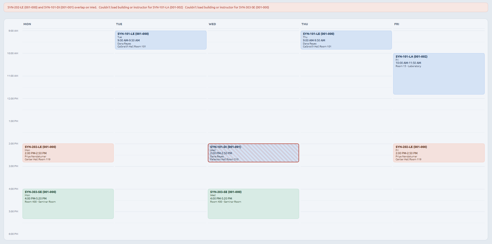

# TSS Schedule Visualizer
A Chrome extension tool that helps UCSD students see their quarter schedule.\
NOT AFFILIATED OR ENDORSED BY UCSD. Built by a UCSD student. 

### Preview

## What the extension does
This extension helps students visualize their schedule with all the necessary information upfront.\
It goes from what students are given in TSS and turns it into a Mon–Fri grid color-coded by course, with the building, room and instructor on each block, and overlapping classes flagged.

## Install
To use the extension without getting it from the Chrome Web Store, get the extension folder exclusively from the repo.\
After doing so, go into the extension manager and activate developer mode. A button should appear that says load unpacked.\
Select the extension folder in its entirety and load it. After doing so, make sure to enable it. 

## Usage
Once the extension has been installed, log in to TSS directly. Once you have logged in to TSS, activate the extension and press generate schedule.\
Wait a few seconds and your schedule will pop up in a separate tab. 

## How the extension works
**In simple terms**:\
The extension fetches the data from TSS using both what has been rendered in your booked courses as well as the schedule of classes to fill in any missing information. Two fetches, one outcome. 

**More in-depth**:\
When first retrieving the data from the timetable for a specific schedule, there were 148 rows. After some in-depth searching it was found that these were all the occurrences in the quarter for the booked classes. In reality there were 8 sections. Grouping by id was the selected approach but with an important distinction to make. Holidays had to be avoided so that it didn't look like an extra section within the day. Seeing that they shared the same EventId, the next steps taken were helpful to filter these out. EventType was used to filter and EventId was used to group these occurrences  together. Using this information, the common start/end time pair is found and is published as a section. Using this method, the final exams of each class were also found because they were rows that didn't match with the rest. There is a tag within the data that dictates whether or not an occurrence is an exam, however this is false for everything, exams included, which made the method for grabbing finals a part of this entire method. This is how 8 sections from 148 rows was achieved.\
The days displayed was another obstacle seeing as it arrived in the form of /Date(1790208000000)/ within EventDate. This is known as epoch milliseconds. To get the correct day, getUTCDay() is used as it produces the day of the week that the section takes place in. 0 for Sunday going all the way to 6 for Saturday. This is used instead of getDay() seeing as the usage of getDay() reported a Thursday class as Wednesday class. Similar cases with the other days were found with getDay().\
The fetch from the first batch of data lacked two things: the instructor of the class as well as the name of the building where the class is taking place. To get the necessary information needed a filter by section id was done. This returned 17 rows for 8 sections. However, unrelated information was also pulled meaning more filtering had to be done. A pair between the ModuleID and the EventObjid was made to filter out any unrelated information and get the specific sections we are looking for. Normalization was added to make sure everything matched and so that there are no false positives because of leading 0's. To get the building all that was done is get what was inside the Sched tag and split it by certain characters. @ and the newline operator were these characters. 

## Development
The extension fetches data from two endpoints in TSS with `extension/popup.js`.\
One is from the timetable.\
The other is fetched from the schedule of classes using a specialized filter to get the necessary components to parse through the sections.\
The filter is constructed with the following in mind:\
The academic year, the academic period, and the ids necessary to capture each class section the student is taking.\
After this is done, the two sources of raw information are locally stored within the user's computer.\
The main work is done through the parser, `shared/parser.js` in which information such as the name of the class, the days, and the duration is parsed through to be extracted and used in a way to display said information.\
`visualizer/grid.js` is the file that gets the parsed data and formats it in a way to be shown on the visualizer page.\
`visualizer/conflicts.js` takes care of any cases where there might be an overlap of times on a shared day and displays them on the page when necessary.

## Limitations
As of now, this visualizer is hardcoded to Fall Quarter 2026.\
It is desktop only, mobile support may be added if possible.\
Mostly tested on Edge and Chrome. Additional support may be added as well.

## Privacy Policy

This extension does not have a server. Nothing you do with it is sent anywhere.

**What it reads.** Your schedule, from the TSS session you are already logged into.
It never sees, handles, or stores your password or any login credentials, and it
never signs in on your behalf.\
It only makes the same requests the TSS page makes for itself.

**What it stores.** The schedule data it fetched, in your browser's local extension
storage, on your own computer. That is how the visualizer tab receives it. Nothing
else is stored.

**What it sends.** Nothing. The only network requests are to `tss.ucsd.edu`. No analytics, no telemetry, no third-party service, and no account.

**Permissions, and why.**

| Permission | Why |
| --- | --- |
| `activeTab` | Read the schedule from the TSS tab, only after you click the button |
| `scripting` | Run the fetch inside that tab so your existing session is used |
| `storage` | Pass the schedule to the visualizer tab |

**Removing it.** Uninstalling the extension deletes everything it stored.

**Verifying any of this.** The source is in this repo. The parts that touch
your data are `extension/popup.js` and `shared/parser.js`.

